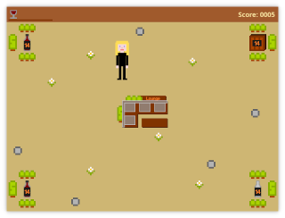

= Wine Lounge

This simple retro game is my first attempt at creating a small game.

Since it was originally written within one day, the code is more of a quick hack than proper software.
But this game may evolve ... ;)

== Gameplay

Use the arrow keys to move the lady to hidden boxes, collect empty glasses and fill them with delicious wine.
Bring the wine to her wine lounge and increase your score. But beware of the stumbling blocks.

That's all.
